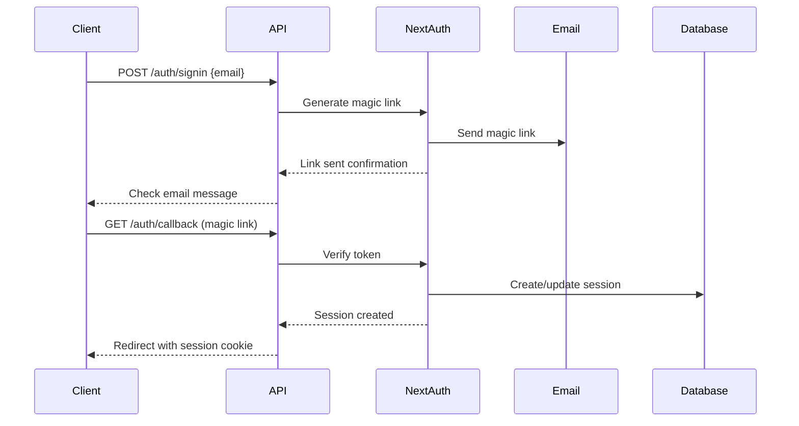

# HOAdoor API Documentation

## Overview

HOAdoor provides a comprehensive REST API built with Next.js API routes that handles all platform functionality including authentication, search, reviews, community management, and administration.

## Base URL

- **Development**: `http://localhost:3000/api`
- **Production**: `https://your-domain.com/api`

## Authentication

All API requests use session-based authentication via NextAuth.js. Users authenticate via magic email links.

### Authentication Flow



### Session Management

```typescript
// Session object structure
interface Session {
  user: {
    id: string
    email: string
    name?: string
    roles: string[]
  }
  expires: string
}
```

## Rate Limiting

All endpoints implement rate limiting to prevent abuse:

| Endpoint Type | Limit | Window |
|--------------|-------|--------|
| Search | 100 requests | 1 minute |
| Review Submission | 5 reviews | 24 hours |
| Membership Requests | 3 requests | 24 hours |
| Post Creation | 10 posts | 1 hour |
| Comment Creation | 30 comments | 1 hour |
| Flagging Content | 5 flags | 1 hour |

Rate limit headers are included in responses:
```
X-RateLimit-Limit: 100
X-RateLimit-Remaining: 87
X-RateLimit-Reset: 1640995200
```

## Error Handling

All API responses follow a consistent error format:

```typescript
interface APIError {
  error: string           // Human-readable error message
  code?: string          // Machine-readable error code
  details?: any          // Additional error context
  timestamp: string      // ISO 8601 timestamp
}
```

### HTTP Status Codes

- **200 OK**: Successful request
- **201 Created**: Resource created successfully
- **400 Bad Request**: Invalid request data
- **401 Unauthorized**: Authentication required
- **403 Forbidden**: Insufficient permissions
- **404 Not Found**: Resource not found
- **409 Conflict**: Resource conflict (duplicate)
- **422 Unprocessable Entity**: Validation failed
- **429 Too Many Requests**: Rate limit exceeded
- **500 Internal Server Error**: Server error

## API Endpoints

### Search & Discovery

#### Search HOAs

Search and filter HOA communities with advanced options.

**Endpoint**: `GET /api/search`

**Parameters**:
```typescript
interface SearchParams {
  q?: string              // Search query
  location?: string       // City, state, or ZIP
  state?: string         // State filter
  city?: string          // City filter
  ratingMin?: number     // Minimum rating (1-5)
  amenities?: string[]   // Array of amenity filters
  page?: number          // Page number (default: 1)
  limit?: number         // Results per page (default: 20, max: 50)
}
```

**Example Request**:
```bash
GET /api/search?q=sunset&location=san diego&ratingMin=4&amenities=Pool,Gym&page=1&limit=12
```

**Response**:
```typescript
interface SearchResponse {
  hoas: {
    id: string
    name: string
    slug: string
    location: string
    city: string
    state: string
    amenities: string[]
    unitCount: number | null
    descriptionPublic: string | null
    rating: {
      average: number
      count: number
      breakdown: Record<string, number>
    } | null
    reviewCount: number
    memberCount: number
    createdAt: string
  }[]
  pagination: {
    page: number
    limit: number
    total: number
    totalPages: number
    hasMore: boolean
  }
}
```

**Example Response**:
```json
{
  "hoas": [
    {
      "id": "cljk1234567890",
      "name": "Sunset Ridge Community",
      "slug": "sunset-ridge-community",
      "location": "San Diego, CA 92127",
      "city": "San Diego",
      "state": "CA",
      "amenities": ["Pool", "Gym", "Tennis Court", "Clubhouse"],
      "unitCount": 450,
      "descriptionPublic": "Beautiful gated community with modern amenities...",
      "rating": {
        "average": 4.2,
        "count": 87,
        "breakdown": {"1": 2, "2": 5, "3": 12, "4": 35, "5": 33}
      },
      "reviewCount": 87,
      "memberCount": 234,
      "createdAt": "2024-01-15T10:30:00Z"
    }
  ],
  "pagination": {
    "page": 1,
    "limit": 12,
    "total": 156,
    "totalPages": 13,
    "hasMore": true
  }
}
```

#### Get HOA Profile

Retrieve detailed information about a specific HOA.

**Endpoint**: `GET /api/hoas/[slug]`

**Parameters**:
- `slug` (path): HOA slug identifier

**Example Request**:
```bash
GET /api/hoas/sunset-ridge-community
```

**Response**:
```typescript
interface HOAProfileResponse {
  id: string
  name: string
  slug: string
  descriptionPublic: string | null
  location: string
  city: string
  state: string
  zipCode: string | null
  amenities: string[]
  unitCount: number | null
  createdAt: string
  rating: {
    average: number
    count: number
    breakdown: Record<string, number>
  } | null
  reviewCount: number
  memberCount: number
  recentReviews: {
    id: string
    stars: number
    text: string | null
    createdAt: string
    user: { name: string } | { name: "Anonymous" }
    adminResponses: {
      id: string
      text: string
      createdAt: string
      responder: { id: string, name: string }
    }[]
  }[]
}
```

### Reviews & Ratings

#### Submit Review

Submit a review for an HOA community.

**Endpoint**: `POST /api/reviews`

**Authentication**: Required

**Request Body**:
```typescript
interface CreateReviewRequest {
  hoaId: string          // HOA ID
  stars: number          // Rating 1-5
  text?: string          // Optional review text (max 2000 chars)
  isAnonymous?: boolean  // Post anonymously (default: false)
}
```

**Example Request**:
```bash
POST /api/reviews
Content-Type: application/json

{
  "hoaId": "cljk1234567890",
  "stars": 4,
  "text": "Great community with excellent amenities. Management is responsive and the grounds are well-maintained.",
  "isAnonymous": false
}
```

**Response**:
```typescript
interface CreateReviewResponse {
  id: string
  stars: number
  text: string | null
  isAnonymous: boolean
  status: "PENDING" | "APPROVED" | "REJECTED"
  createdAt: string
  hoa: {
    id: string
    name: string
    slug: string
  }
  user: {
    id: string
    name: string
  } | null
}
```

#### Get Reviews

Retrieve reviews for a specific HOA.

**Endpoint**: `GET /api/reviews`

**Parameters**:
```typescript
interface GetReviewsParams {
  hoaId: string         // Required: HOA ID
  page?: number         // Page number (default: 1)
  limit?: number        // Results per page (default: 10, max: 50)
  status?: "PENDING" | "APPROVED" | "REJECTED" // Filter by status
}
```

**Example Request**:
```bash
GET /api/reviews?hoaId=cljk1234567890&page=1&limit=10
```

**Response**:
```typescript
interface GetReviewsResponse {
  reviews: {
    id: string
    stars: number
    text: string | null
    createdAt: string
    user: { name: string } | { name: "Anonymous" }
    adminResponses: {
      id: string
      text: string
      createdAt: string
      responder: { id: string, name: string }
    }[]
  }[]
  pagination: {
    page: number
    limit: number
    total: number
    totalPages: number
    hasMore: boolean
  }
}
```

### Community Management

#### Request Membership

Request to join an HOA community.

**Endpoint**: `POST /api/memberships`

**Authentication**: Required

**Request Body**:
```typescript
interface MembershipRequestRequest {
  hoaId: string         // HOA ID to join
  note?: string         // Optional note for admin (max 500 chars)
}
```

**Example Request**:
```bash
POST /api/memberships
Content-Type: application/json

{
  "hoaId": "cljk1234567890",
  "note": "I'm a resident at 123 Main St and would like to join the community portal."
}
```

**Response**:
```typescript
interface MembershipRequestResponse {
  id: string
  status: "PENDING" | "APPROVED" | "REJECTED"
  role: "MEMBER" | "ADMIN" | "PRESIDENT"
  note: string | null
  createdAt: string
  hoa: {
    id: string
    name: string
    slug: string
  }
  user: {
    id: string
    name: string
    email: string
  }
}
```

#### Approve/Reject Membership

Approve or reject membership requests (HOA Admin only).

**Endpoint**: `POST /api/memberships/approve`

**Authentication**: Required (HOA Admin or higher)

**Request Body**:
```typescript
interface MembershipActionRequest {
  membershipId: string           // Membership request ID
  action: "APPROVE" | "REJECT"   // Action to take
  reason?: string                // Optional reason for rejection
}
```

**Example Request**:
```bash
POST /api/memberships/approve
Content-Type: application/json

{
  "membershipId": "cljk9876543210",
  "action": "APPROVE"
}
```

**Response**:
```typescript
interface MembershipActionResponse {
  id: string
  status: "APPROVED" | "REJECTED"
  role: string
  updatedAt: string
  user: {
    id: string
    name: string
    email: string
  }
}
```

### Admin Operations

#### Respond to Review

Submit an admin response to a review (HOA Admin only).

**Endpoint**: `POST /api/admin/responses`

**Authentication**: Required (HOA Admin or higher)

**Request Body**:
```typescript
interface AdminResponseRequest {
  reviewId: string      // Review ID to respond to
  text: string          // Response text (10-1000 chars)
}
```

**Example Request**:
```bash
POST /api/admin/responses
Content-Type: application/json

{
  "reviewId": "cljk5555555555",
  "text": "Thank you for your feedback! We're glad you're enjoying the community amenities."
}
```

**Response**:
```typescript
interface AdminResponseResponse {
  id: string
  text: string
  createdAt: string
  responder: {
    id: string
    name: string
  }
  review: {
    id: string
    stars: number
  }
}
```

### Content Management

#### Flag Content

Flag inappropriate content for moderation.

**Endpoint**: `POST /api/flags`

**Authentication**: Required

**Request Body**:
```typescript
interface FlagContentRequest {
  targetType: "REVIEW" | "POST" | "COMMENT" | "USER"
  targetId: string      // ID of the content being flagged
  reason: string        // Reason for flagging (10-500 chars)
}
```

**Example Request**:
```bash
POST /api/flags
Content-Type: application/json

{
  "targetType": "REVIEW",
  "targetId": "cljk5555555555",
  "reason": "This review contains inappropriate language and false accusations."
}
```

**Response**:
```typescript
interface FlagContentResponse {
  id: string
  targetType: string
  targetId: string
  reason: string
  status: "PENDING" | "RESOLVED" | "DISMISSED"
  createdAt: string
}
```

### Community Posts

#### Create Post

Create a new community post (Members only).

**Endpoint**: `POST /api/posts`

**Authentication**: Required (HOA Member or higher)

**Request Body**:
```typescript
interface CreatePostRequest {
  hoaId: string         // HOA ID
  title: string         // Post title (5-200 chars)
  body: string          // Post body (10-10000 chars)
  visibility?: "PUBLIC" | "PRIVATE"  // Default: PRIVATE
}
```

**Example Request**:
```bash
POST /api/posts
Content-Type: application/json

{
  "hoaId": "cljk1234567890",
  "title": "Community BBQ This Weekend",
  "body": "Join us for our annual community BBQ this Saturday from 2-6 PM at the clubhouse. Food and drinks will be provided!",
  "visibility": "PRIVATE"
}
```

**Response**:
```typescript
interface CreatePostResponse {
  id: string
  title: string
  body: string
  visibility: "PUBLIC" | "PRIVATE"
  status: "PENDING" | "APPROVED" | "REJECTED"
  isPinned: boolean
  createdAt: string
  author: {
    id: string
    name: string
  }
  hoa: {
    id: string
    name: string
  }
}
```

#### Get Posts

Retrieve community posts for an HOA.

**Endpoint**: `GET /api/posts`

**Authentication**: Required (HOA Member or higher for private posts)

**Parameters**:
```typescript
interface GetPostsParams {
  hoaId: string         // Required: HOA ID
  page?: number         // Page number (default: 1)
  limit?: number        // Results per page (default: 10, max: 50)
  visibility?: "PUBLIC" | "PRIVATE" | "ALL"
}
```

### Analytics (Admin Only)

#### HOA Analytics

Get analytics data for an HOA (Admin only).

**Endpoint**: `GET /api/analytics/hoa/[hoaId]`

**Authentication**: Required (HOA Admin or higher)

**Response**:
```typescript
interface HOAAnalyticsResponse {
  overview: {
    memberCount: number
    reviewCount: number
    averageRating: number
    postCount: number
    eventCount: number
  }
  ratings: {
    trend: Array<{ month: string, average: number, count: number }>
    distribution: Record<string, number>
  }
  engagement: {
    activeMembers: number
    postsThisMonth: number
    commentsThisMonth: number
    eventsThisMonth: number
  }
  reviews: {
    pending: number
    approved: number
    rejected: number
    needsResponse: number
  }
}
```

## Data Models

### Core Entities

```typescript
// User model
interface User {
  id: string
  name: string | null
  email: string
  emailVerified: Date | null
  avatarUrl: string | null
  roles: string[]
  createdAt: Date
  updatedAt: Date
}

// HOA model
interface HOA {
  id: string
  name: string
  slug: string
  descriptionPublic: string | null
  descriptionPrivate: string | null
  location: string
  city: string
  state: string
  zipCode: string | null
  amenities: string[]
  unitCount: number | null
  createdAt: Date
  updatedAt: Date
}

// Review model
interface Review {
  id: string
  userId: string
  hoaId: string
  stars: number
  text: string | null
  isAnonymous: boolean
  status: "PENDING" | "APPROVED" | "REJECTED"
  createdAt: Date
  updatedAt: Date
}

// Membership model
interface Membership {
  id: string
  userId: string
  hoaId: string
  role: "MEMBER" | "ADMIN" | "PRESIDENT"
  status: "PENDING" | "APPROVED" | "REJECTED"
  note: string | null
  createdAt: Date
  updatedAt: Date
}
```

## Validation Schemas

All API endpoints use Zod for input validation:

```typescript
// Review validation
const createReviewSchema = z.object({
  hoaId: z.string().cuid(),
  stars: z.number().min(1).max(5),
  text: z.string().min(10).max(2000).optional(),
  isAnonymous: z.boolean().default(false),
})

// Search validation
const searchSchema = z.object({
  q: z.string().optional(),
  location: z.string().optional(),
  ratingMin: z.number().min(1).max(5).optional(),
  amenities: z.array(z.string()).optional(),
  page: z.number().min(1).default(1),
  limit: z.number().min(1).max(50).default(20),
})
```

## SDK Examples

### JavaScript/TypeScript Client

```typescript
class HOAdoorAPI {
  constructor(private baseURL: string) {}

  async searchHOAs(params: SearchParams): Promise<SearchResponse> {
    const query = new URLSearchParams(params as any)
    const response = await fetch(`${this.baseURL}/search?${query}`)
    return response.json()
  }

  async submitReview(review: CreateReviewRequest): Promise<CreateReviewResponse> {
    const response = await fetch(`${this.baseURL}/reviews`, {
      method: 'POST',
      headers: { 'Content-Type': 'application/json' },
      body: JSON.stringify(review),
      credentials: 'include',
    })
    return response.json()
  }

  async getHOAProfile(slug: string): Promise<HOAProfileResponse> {
    const response = await fetch(`${this.baseURL}/hoas/${slug}`)
    return response.json()
  }
}

// Usage
const api = new HOAdoorAPI('http://localhost:3000/api')
const results = await api.searchHOAs({ q: 'sunset', ratingMin: 4 })
```

### cURL Examples

```bash
# Search HOAs
curl -X GET "http://localhost:3000/api/search?q=sunset&ratingMin=4" \
  -H "Accept: application/json"

# Submit review (requires session cookie)
curl -X POST "http://localhost:3000/api/reviews" \
  -H "Content-Type: application/json" \
  -H "Cookie: next-auth.session-token=..." \
  -d '{
    "hoaId": "cljk1234567890",
    "stars": 4,
    "text": "Great community!"
  }'

# Get HOA profile
curl -X GET "http://localhost:3000/api/hoas/sunset-ridge-community" \
  -H "Accept: application/json"
```

This API documentation provides comprehensive coverage of all HOAdoor endpoints with examples, validation rules, and response formats for building integrations and client applications.
