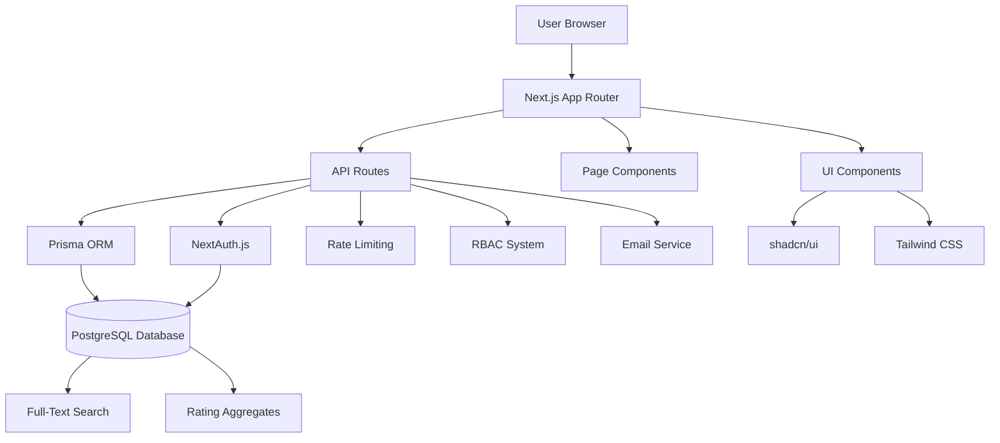
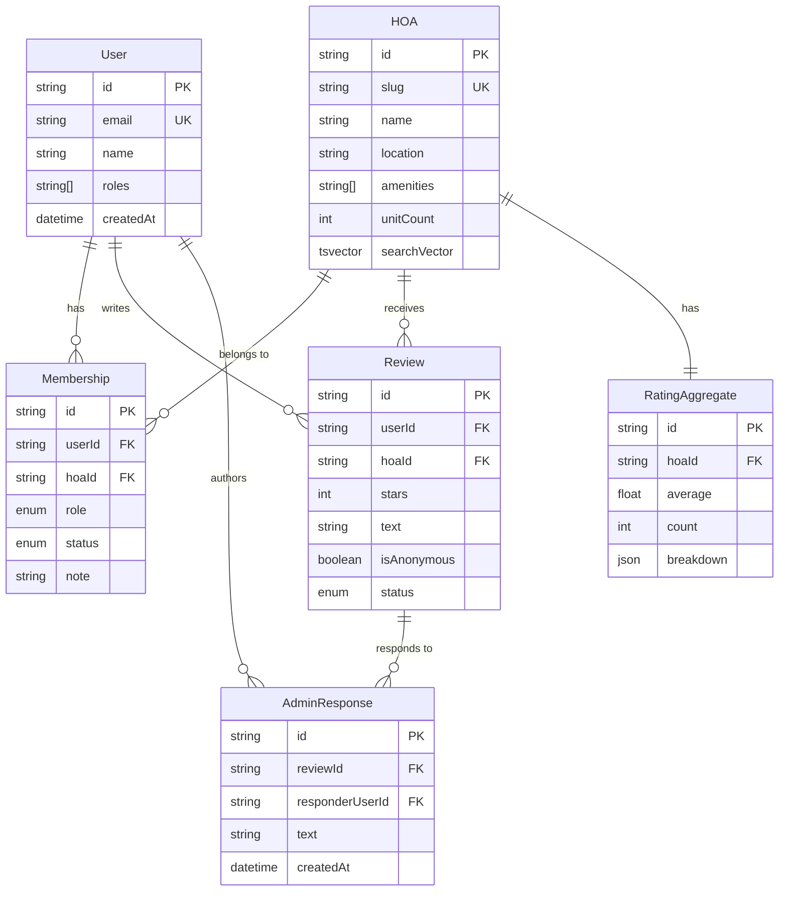

# HOAdoor System Architecture

## Overview

HOAdoor is a full-stack web application built with Next.js that provides transparency and community management tools for Homeowners Associations (HOAs). The system combines public review functionality with private community features.

## High-Level Architecture



## System Components

### Frontend Layer

**Next.js 14 App Router**
- Server-side rendering for SEO and performance
- Client-side hydration for interactivity
- Automatic code splitting and optimization

**UI Framework**
- React 18 with TypeScript for type safety
- Tailwind CSS for consistent styling
- shadcn/ui for accessible component library
- Lucide React for consistent iconography

### API Layer

**Next.js API Routes**
- RESTful endpoints with proper HTTP methods
- Zod validation for all inputs
- Comprehensive error handling
- Rate limiting on sensitive endpoints

### Authentication & Authorization

**NextAuth.js Integration**
- Email magic link authentication (no passwords)
- Session management with database persistence
- Extensible provider system

**Role-Based Access Control (RBAC)**
- Hierarchical role system
- Permission checking at API and UI levels
- Audit logging for admin actions

### Data Layer

**PostgreSQL Database**
- ACID compliance for data integrity
- JSON columns for flexible metadata
- Full-text search with tsvector columns
- Optimized indexes for common queries

**Prisma ORM**
- Type-safe database access
- Automatic migration system
- Connection pooling and optimization

## Database Schema Design

### Core Entities



### Permission Matrix

| Resource | Public | Member | HOA Admin | Platform Admin |
|----------|--------|--------|-----------|----------------|
| View HOA Profile | ✅ | ✅ | ✅ | ✅ |
| Submit Review | ✅* | ✅ | ✅ | ✅ |
| View Private Community | ❌ | ✅ | ✅ | ✅ |
| Create Posts | ❌ | ✅ | ✅ | ✅ |
| Moderate Content | ❌ | ❌ | ✅ | ✅ |
| Manage Members | ❌ | ❌ | ✅ | ✅ |
| Global Moderation | ❌ | ❌ | ❌ | ✅ |

*Requires authentication

## Performance Considerations

### Database Optimization
- Indexed columns for common queries (slug, email, hoaId+status)
- Materialized rating aggregates for fast display
- Full-text search vectors updated via triggers
- Connection pooling through Prisma

### Caching Strategy
- Next.js automatic static generation for public pages
- Server-side caching for search results
- Client-side caching with React Query patterns
- CDN caching for static assets

### Rate Limiting
- Database-based sliding window algorithm
- Per-user and per-IP limits
- Different limits for different endpoint types
- Automatic cleanup of expired rate limit records

## Security Architecture

### Authentication Flow
1. User enters email address
2. Magic link sent via email
3. Link verification creates session
4. Session stored in database
5. Subsequent requests verified via session

### Authorization Enforcement
```typescript
// Permission checking example
export async function canModerateHOAContent(userId: string, hoaId: string): Promise<boolean> {
  const membership = await getUserMembership(userId, hoaId)
  return membership?.status === 'APPROVED' && 
         (membership.role === 'ADMIN' || membership.role === 'PRESIDENT')
}
```

### Content Security
- All user inputs validated with Zod schemas
- SQL injection prevention through Prisma ORM
- XSS protection via React's built-in escaping
- CSRF protection through NextAuth.js
- Rate limiting prevents abuse

## Scalability Patterns

### Horizontal Scaling
- Stateless API design allows multiple server instances
- Database connection pooling prevents connection exhaustion
- CDN distribution for static assets
- Microservice-ready architecture

### Vertical Scaling
- Efficient database queries with proper indexing
- Lazy loading for large data sets
- Pagination for all list endpoints
- Image optimization through Next.js

## Monitoring & Observability

### Logging Strategy
- Structured logging with consistent formats
- Error tracking and alerting
- Performance metrics collection
- Audit logs for admin actions

### Health Checks
- Database connectivity monitoring
- API endpoint health checks
- Rate limit threshold monitoring
- Email service availability

## Deployment Architecture

### Production Stack
- **Frontend/API:** Vercel Edge Network
- **Database:** Neon (Serverless PostgreSQL)
- **Email:** SendGrid or similar service
- **CDN:** Vercel Edge Network
- **Monitoring:** Vercel Analytics + custom dashboards

### CI/CD Pipeline
1. Code pushed to repository
2. Automated testing (unit + integration)
3. Build verification
4. Deployment to staging
5. Production deployment (main branch)
6. Health check verification

## Future Architecture Considerations

### Microservices Evolution
Current monolithic structure can evolve to:
- Authentication service
- Community management service
- Search and discovery service
- Notification service

### Enhanced Search
- Elasticsearch integration for advanced search
- Geographic search capabilities
- AI-powered recommendation engine
- Real-time search suggestions

### Real-time Features
- WebSocket integration for live notifications
- Real-time community chat features
- Live moderation dashboards
- Push notifications for mobile apps

This architecture provides a solid foundation that can scale from hundreds to hundreds of thousands of users while maintaining performance and reliability.
